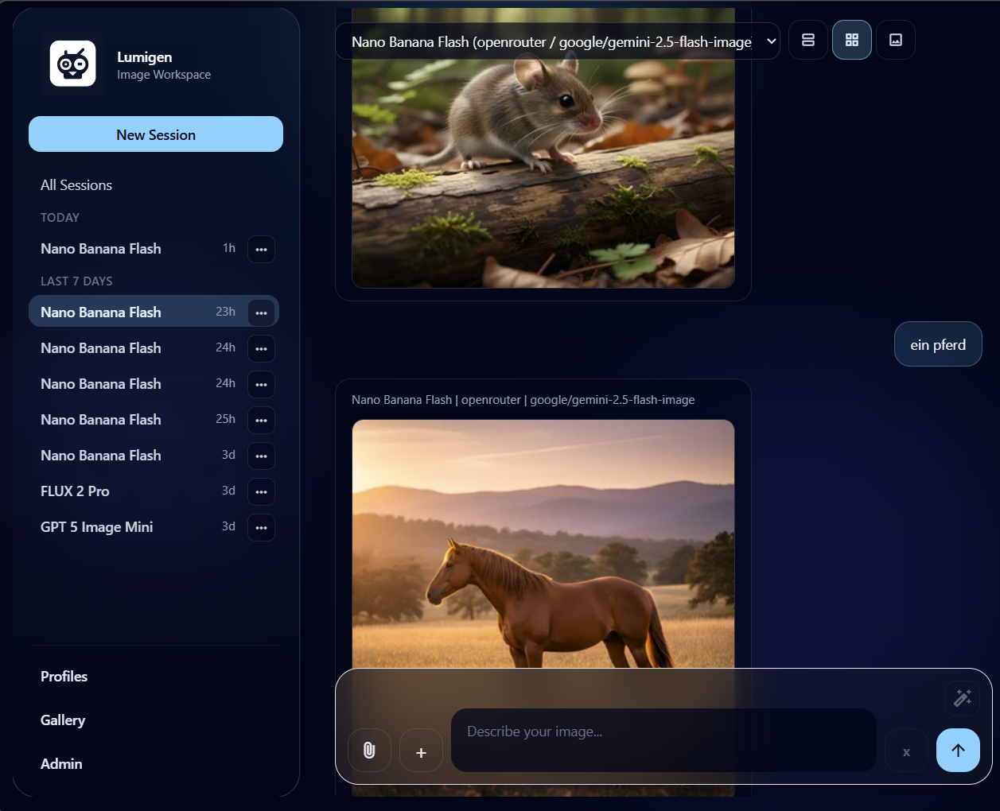
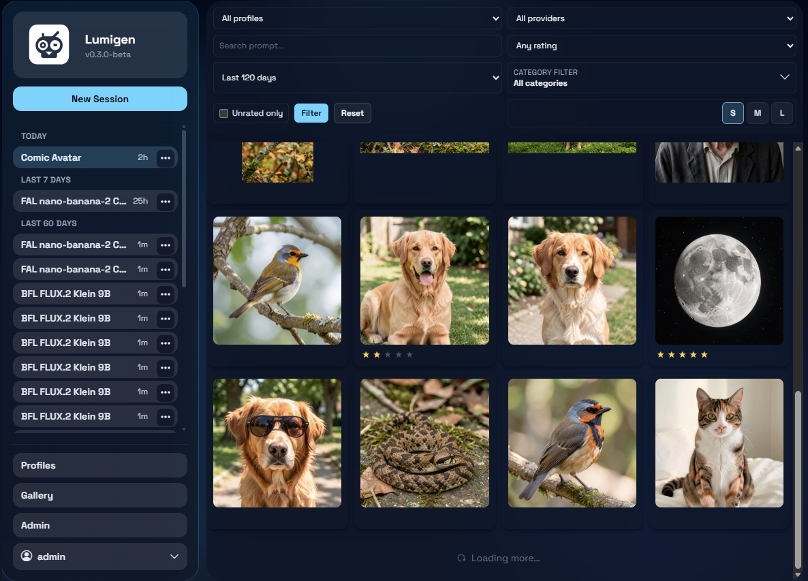

# Lumigen

Lumigen is your local AI image studio.
Create images from prompts, keep everything organized, and iterate quickly with profiles, sessions, and a clean gallery workflow — all from one lightweight web app.

## App preview

> Put your screenshots here so they render on GitHub: `docs/screenshots/`




## Why Lumigen

- 🏡 **Local-first by default**: your images, metadata, and DB stay under `./data`
- ⚡ **Fast creative loop**: generate, tweak, rerun, and compare in seconds
- 🧩 **Flexible providers**: connect OpenAI, OpenRouter, Google, BFL
- 🗂️ **Profiles & categories**: save your favorite setups and keep outputs tidy
- 🖼️ **Gallery workflow**: browse, filter, download, and manage assets easily
- 🔍 **Reproducible history**: snapshots help you understand how each image was created
- 🚀 **Optional upscaling**: improve output resolution with Real-ESRGAN

## Tech stack

- Backend: FastAPI + Jinja2 + HTMX
- Database: SQLite + SQLAlchemy 2 + Alembic
- HTTP clients: `httpx`
- Image processing: `Pillow`
- Secret encryption for model keys: `cryptography` (Fernet)

## Project structure

- `app/main.py`: route definitions and service wiring
- `app/services/`: generation, storage, thumbnails, sidecars, gallery, enhancement
- `app/providers/`: provider adapters and registry with retry/rate-limit policy
- `app/db/`: SQLAlchemy models, CRUD helpers, DB session/engine
- `alembic/`: schema migrations
- `scripts/`: Docker run/update helpers and provider key generation

## Getting started

### Prerequisites

- Python 3.12+
- pip
- Optional: Docker

### 1) Clone and enter the repository

```bash
git clone <your-repo-url>
cd lumigen
```

### 2) Create and activate a virtual environment

Windows PowerShell:

```powershell
python -m venv .venv
.\.venv\Scripts\Activate.ps1
```

macOS/Linux:

```bash
python -m venv .venv
source .venv/bin/activate
```

### 3) Install dependencies

```bash
pip install -r requirements.txt
```

### 4) Configure environment

Windows:

```powershell
copy .env.example .env
```

macOS/Linux:

```bash
cp .env.example .env
```

For a local-only first run, the default `.env` values are enough.

### 5) Run database migrations

```bash
alembic upgrade head
```

### 6) Start the app

```bash
python -m app.main
```

Alternative dev command:

```bash
uvicorn app.main:app --reload --port 8010
```

Open: `http://127.0.0.1:8010`

## First-time app usage

1. Open **Profiles** and create a profile.
2. Choose provider:
	- `stub` for local testing without external API calls
	- any cloud provider if API keys are configured
3. Go to **Generate**, enter a prompt, submit.
4. Check **Gallery** for generated assets and metadata.

## Provider configuration

Set provider API keys in `.env` for default usage:

- `OPENAI_API_KEY`
- `OPENROUTER_API_KEY`
- `GOOGLE_API_KEY`
- `BFL_API_KEY`

For per-model custom API keys in Admin, set `PROVIDER_CONFIG_KEY` first.
Generate one with:

- Bash: `./scripts/generate_provider_key.sh`
- PowerShell: `./scripts/generate_provider_key.ps1`

## Docker

Run (build + start on port `7003`):

macOS/Linux:

```bash
./scripts/docker_run.sh
```

Windows PowerShell:

```powershell
.\scripts\docker_run.ps1
```

Update container after pulling new changes:

macOS/Linux:

```bash
./scripts/docker_update.sh
```

Windows PowerShell:

```powershell
.\scripts\docker_update.ps1
```

Optional in `.env`:

```dotenv
DOCKER_DATA_DIR=./data
```

Open: `http://127.0.0.1:7003`

## Upscaling (optional, Linux + Real-ESRGAN)

Lumigen can upscale generated images with Real-ESRGAN NCNN Vulkan.

1. Download the Linux Real-ESRGAN NCNN Vulkan binary:
	- https://github.com/xinntao/Real-ESRGAN/releases
2. Download NCNN model files manually (`.param` + `.bin`).
	- Example model names used by default: `realesrgan-x2plus` and `realesrgan-x4plus`
	- Required files per model: `realesrgan-x2plus.param` + `realesrgan-x2plus.bin`
3. Place the model files in your configured model directory (`UPSCALER_MODEL_DIR`).
	- Default: `./data/models/realesrgan`
4. Configure `.env`:

```dotenv
UPSCALER_COMMAND=/usr/local/bin/realesrgan-ncnn-vulkan
UPSCALER_MODEL_DIR=./data/models/realesrgan
```

### Docker: option A (embed binary into image)

Use this if you want the executable inside the image itself.

1. Copy the Linux executable into the repository at:
	- `docker/realesrgan-ncnn-vulkan`
2. Rebuild/restart Docker:
	- PowerShell: `./scripts/docker_update.ps1`
	- Bash: `./scripts/docker_update.sh`
3. Keep model files in shared data dir (see option B below).

During Docker build, Lumigen installs the binary automatically when this file exists.

### Docker: option B (shared folder for binary + models)

Use this if you do not want to rebuild the image for binary updates.

1. Place binary on host:
	- `./data/bin/realesrgan-ncnn-vulkan`
2. Place models on host:
	- `./data/models/realesrgan`
3. Configure `.env`:

```dotenv
UPSCALER_COMMAND=/app/data/bin/realesrgan-ncnn-vulkan
UPSCALER_MODEL_DIR=/app/data/models/realesrgan
```

Shared-path mapping (default):

- Host data dir: `./data`
- Container data dir: `/app/data`
- Ensure `DOCKER_DATA_DIR` points to the host folder you want to share.

### Docker troubleshooting (Vulkan)

If you see:

`error while loading shared libraries: libvulkan.so.1: cannot open shared object file`

then rebuild the image so Vulkan runtime libraries are included:

- PowerShell: `./scripts/docker_update.ps1`
- Bash: `./scripts/docker_update.sh`

If you want hardware Vulkan acceleration from host GPU, ensure your Docker runtime is configured for GPU passthrough (for example NVIDIA Container Toolkit on NVIDIA systems).

## Development notes

- Migrations are required for schema changes: add Alembic migration under `alembic/versions/`.
- The app also calls `Base.metadata.create_all()` during startup for local bootstrap, but Alembic remains the source of schema evolution.
- Backend tests run with `pytest`.
- Run all backend tests: `pytest -q`
- Run focused suites: `pytest -q tests/unit` and `pytest -q tests/routes`
- Frontend route/template tests (server-rendered Jinja + HTMX): `pytest -q tests/frontend`
- Coverage baseline (terminal report): `pytest --cov=app --cov-report=term-missing -q`

## Optional frontend migration path

The repository can include a Next.js frontend under `frontend/` as a migration path from server-rendered templates. It reads from the same SQLite data and forwards generation requests to FastAPI.

## License

See `LICENSE`.
