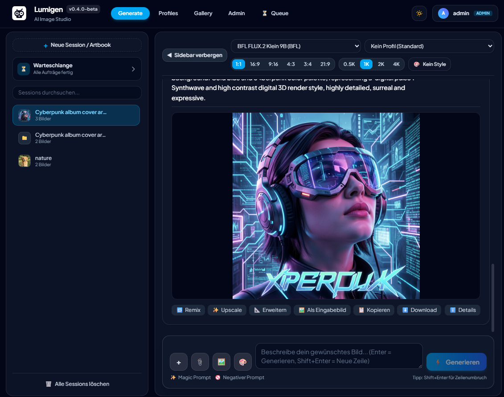
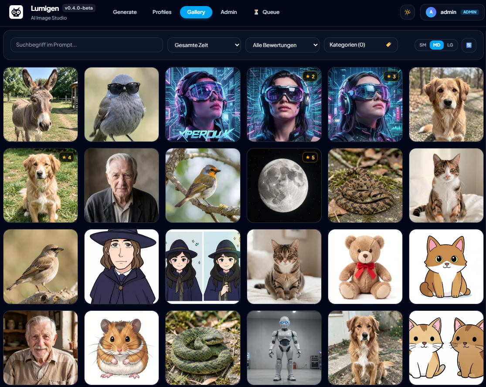

# Lumigen

**One interface. All your AI image providers.**

Stop switching between FAL, OpenAI, Google and OpenRouter. 
Lumigen connects them all in one lightweight local app - 
no subscription, no tracking, your images stay on your machine.





## Why Lumigen

Tired of juggling multiple image generation platforms? 
Lumigen gives you a single, clean workspace to generate, 
compare, and organize AI images — across all major providers.

- 🔀 **One app, many providers**: FAL, OpenAI, OpenRouter, Google, BFL — switch in seconds
- ⏳ **Generation queue**: start multiple jobs consecutively without waiting; backend FIFO semaphore prevents provider overloads
- 🔄 **One-click retry**: instantly re-run failed or cancelled generations with identical settings
- 🎯 **Decoupled workflow**: switch models and profiles freely without unintentional parameter/model overrides
- 🏡 **Your data, your machine**: images and history stay under `./data`, always
- ⚡ **Fast creative loop**: generate, tweak, rerun, and compare without leaving the app
- 📤 **Data portability**: import/export profiles, models, and styles via JSON
- 📦 **Complete archiving**: export full sessions as ZIP with prompts and metadata
- 🗂️ **Stay organized**: profiles, categories, and a full gallery workflow built in
- 🔍 **Full history**: every image is reproducible, metadata and all
- 🚀 **Optional upscaling**: Real-ESRGAN and FAL Topaz upscaling built in

## Getting started

### Prerequisites

- Python 3.12+
- Node.js 20+ and npm (for building the frontend SPA)
- pip
- Optional: Docker

### 1) Clone and enter the repository

```bash
git clone <your-repo-url>
cd lumigen
```

### 2) Create and activate a virtual environment

Windows PowerShell:

```powershell
python -m venv .venv
.\.venv\Scripts\Activate.ps1
```

macOS/Linux:

```bash
python -m venv .venv
source .venv/bin/activate
```

### 3) Install dependencies

Python packages:
```bash
pip install -r requirements.txt
```

Frontend Node packages:
```bash
npm install
```

### 4) Configure environment

Windows:

```powershell
copy .env.example .env
```

macOS/Linux:

```bash
cp .env.example .env
```

For a local-only first run, the default `.env` values are enough.

### 5) Run database migrations

```bash
alembic upgrade head
```

### 6) Build the frontend SPA

```bash
npm run build
```

> **Tip:** For interactive frontend development with Hot Module Replacement (HMR), run `npm run dev` in parallel and visit Vite's dev server.

### 7) Start the app

```bash
python -m app.main
```

Alternative dev command:

```bash
uvicorn app.main:app --reload --port 8010
```

Open: `http://127.0.0.1:8010`

## First-time app usage

1. Open **Profiles** and create a profile.
2. Choose provider:
   - any cloud provider if API keys are configured
3. Go to **Generate**, enter a prompt, submit.
4. Check **Gallery** for generated assets and metadata.

## Generation Queue & Workflow

Lumigen features a dedicated background generation queue with intelligent job management:

- **Continuous Submissions**: Submit multiple prompts and settings consecutively. The Generate button remains active and shows a queued counter (e.g. `+2`), so you never have to wait for one job to finish before queuing the next.
- **Backend Concurrency Control**: A server-side semaphore orchestrates generation runs sequentially. Jobs wait in the database with status `queued` until the lock is acquired, protecting against rate limit hits and GPU resource contention.
- **Slide-Over Queue Drawer**: Click the **Queue** button in the top navigation bar or the **Warteschlange** tile in the left studio sidebar to slide open the queue panel.
  - **Live Progress**: See real-time progress bars, processing percentages, prompt snippets, and active models.
  - **Direct Cancellation**: Cancel any pending or running job instantly (`✕ Cancel`).
  - **History & Instant Retry**: View recently finished, failed, or cancelled jobs.
- **Failed Job Recovery**: Every failed or cancelled generation card includes an immediate **"🔄 Retry"** button that clones and re-enqueues the exact parameters without manual re-entry.
- **Persistent Across All Pages**: The queue runs in the background and is accessible from any view (Generate Studio, Gallery, Profiles, Admin Settings). Navigation never interrupts ongoing jobs.

## Auth rollout checklist

Use this checklist when deploying the login/role feature to a new or existing instance.

1. Install dependencies and run latest migration:

```bash
pip install -r requirements.txt
alembic upgrade head
```

2. Set a strong session secret in `.env`:

```dotenv
SESSION_SECRET_KEY=<long-random-secret>
```

3. Configure cookie security for your environment:

- local dev over HTTP: `SESSION_HTTPS_ONLY=false`
- production behind HTTPS: `SESSION_HTTPS_ONLY=true`

If Lumigen runs behind a reverse proxy / TLS terminator, also enable forwarded header trust so request URLs keep the `https` scheme:

```dotenv
PROXY_HEADERS_ENABLED=true
PROXY_HEADERS_TRUSTED_HOSTS=*
```

Use a narrower trusted host/IP list instead of `*` when possible.

4. Start the app and open `/login`.

5. First login flow:

- if no users exist, `/login` shows onboarding and creates the first user as `admin`
- afterwards, `/login` switches to normal sign-in mode

6. Verify role behavior:

- `admin`: full access, including `/admin` and all admin dialogs
- `user`: no access to admin dialogs/routes

7. Optional smoke check:

```bash
python3.12 -m pytest -q tests/routes tests/ui_routes
```

### Dev-only onboarding reset

For local testing, you can enable a reset button in **Admin → Users**:

```dotenv
AUTH_ALLOW_ONBOARDING_RESET=true
```

Behavior:

- visible only for admins
- deletes all users
- logs out current session
- redirects to `/login` so onboarding is shown again

Security note:

- keep `AUTH_ALLOW_ONBOARDING_RESET=false` in production

## Provider configuration

Set provider API keys in `.env` for default usage:

- `OPENAI_API_KEY`
- `OPENROUTER_API_KEY`
- `GOOGLE_API_KEY`
- `BFL_API_KEY`
- `FAL_API_KEY`

### OpenRouter

Lumigen connects to OpenRouter with automatic API route detection:

- Set `OPENROUTER_API_KEY` in `.env`.
- **Multimodal LLMs**: Models generating images via chat completions are handled seamlessly.
- **Dedicated Image Models (`/api/v1/images`)**: Models requiring OpenRouter's dedicated images endpoint (e.g. OpenAI DALL-E models, Imagen 3, etc.) are automatically routed to `/api/v1/images` with aspect ratio mapping and error resilience.

### FAL.ai

Lumigen uses the FAL.ai queue API for the `fal` provider.

- API docs: <https://docs.fal.ai/examples/model-apis/generate-images-from-text>
- Set `FAL_API_KEY` in `.env`.

Popular models:

- `fal-ai/flux/schnell` — FLUX Schnell (fast)
- `fal-ai/flux/dev` — FLUX Dev
- `fal-ai/flux-pro` — FLUX Pro
- `fal-ai/flux-pro/v1.1` — FLUX Pro v1.1
- `fal-ai/flux-pro/v1.1-ultra` — FLUX Pro v1.1 Ultra

You can pass any additional FAL model parameters via the profile/request params JSON field.

### Google (Gemini / Imagen)

Lumigen uses the Google Generative Language API for the `google` provider.

- Recommended Gemini image model:
	- `gemini-2.0-flash-preview-image-generation`
- Recommended Imagen model:
	- `imagen-3.0-generate-002`

Notes:

- For Gemini image generation, Lumigen calls `models/{model}:generateContent`.
- For Imagen models (`imagen*`), Lumigen calls `models/{model}:predict`.
- You can optionally override endpoint base URL (advanced/self-hosted proxy setups):

```dotenv
GOOGLE_BASE_URL=https://generativelanguage.googleapis.com/v1beta
```

You can pass provider-specific options via profile/request params.
Examples:

- Gemini safety settings:

```json
{
	"safetySettings": [
		{
			"category": "HARM_CATEGORY_DANGEROUS_CONTENT",
			"threshold": "BLOCK_ONLY_HIGH"
		}
	]
}
```

- Imagen parameters:

```json
{
	"aspectRatio": "1:1",
	"personGeneration": "ALLOW_ADULT"
}
```

For per-model custom API keys in Admin, set `PROVIDER_CONFIG_KEY` first.
Generate one with:

- Bash: `./scripts/generate_provider_key.sh`
- PowerShell: `./scripts/generate_provider_key.ps1`

## Docker

Run (build + start on port `7003`):

macOS/Linux:

```bash
./scripts/docker_run.sh
```

Windows PowerShell:

```powershell
.\scripts\docker_run.ps1
```

Update container after pulling new changes:

macOS/Linux:

```bash
./scripts/docker_update.sh
```

Windows PowerShell:

```powershell
.\scripts\docker_update.ps1
```

Optional in `.env`:

```dotenv
DOCKER_DATA_DIR=./data
```

Open: `http://127.0.0.1:7003`

## Upscaling (optional, Linux + Real-ESRGAN)

Lumigen can upscale generated images with Real-ESRGAN NCNN Vulkan.

1. Download the Linux Real-ESRGAN NCNN Vulkan binary:
	- https://github.com/xinntao/Real-ESRGAN/releases
2. Download NCNN model files manually (`.param` + `.bin`).
	- Example model names used by default: `realesrgan-x2plus` and `realesrgan-x4plus`
	- Required files per model: `realesrgan-x2plus.param` + `realesrgan-x2plus.bin`
3. Place the model files in your configured model directory (`UPSCALER_MODEL_DIR`).
	- Default: `./data/models/realesrgan`
4. Configure `.env`:

```dotenv
UPSCALER_COMMAND=/usr/local/bin/realesrgan-ncnn-vulkan
UPSCALER_MODEL_DIR=./data/models/realesrgan
```

### Docker: option A (embed binary into image)

Use this if you want the executable inside the image itself.

1. Copy the Linux executable into the repository at:
	- `docker/realesrgan-ncnn-vulkan`
2. Rebuild/restart Docker:
	- PowerShell: `./scripts/docker_update.ps1`
	- Bash: `./scripts/docker_update.sh`
3. Keep model files in shared data dir (see option B below).

During Docker build, Lumigen installs the binary automatically when this file exists.

### Docker: option B (shared folder for binary + models)

Use this if you do not want to rebuild the image for binary updates.

1. Place binary on host:
	- `./data/bin/realesrgan-ncnn-vulkan`
2. Place models on host:
	- `./data/models/realesrgan`
3. Configure `.env`:

```dotenv
UPSCALER_COMMAND=/app/data/bin/realesrgan-ncnn-vulkan
UPSCALER_MODEL_DIR=/app/data/models/realesrgan
```

Shared-path mapping (default):

- Host data dir: `./data`
- Container data dir: `/app/data`
- Ensure `DOCKER_DATA_DIR` points to the host folder you want to share.

### Docker troubleshooting (Vulkan)

If you see:

`error while loading shared libraries: libvulkan.so.1: cannot open shared object file`

then rebuild the image so Vulkan runtime libraries are included:

- PowerShell: `./scripts/docker_update.ps1`
- Bash: `./scripts/docker_update.sh`

If you want hardware Vulkan acceleration from host GPU, ensure your Docker runtime is configured for GPU passthrough (for example NVIDIA Container Toolkit on NVIDIA systems).

## Development notes

- **Frontend Architecture**: Vue 3 Single-Page Application (SPA) located in `frontend/` powered by Vite, Pinia, Vue Router, and Tailwind CSS.
- **Frontend Dev Server**: Run `npm run dev` in the project root for fast Vite HMR.
- **Frontend Production Build**: Run `npm run build` to compile assets into `app/web/dist/`.
- **Database Migrations**: Add Alembic migrations under `alembic/versions/` for schema changes. Apply with `alembic upgrade head`.
- **Python Linting**: Run `python -m ruff check app/`.
- **Unit Tests**: Run unit tests with `pytest -q tests/unit`.
- **End-to-End Tests**: Run Playwright tests with `npm run test:e2e` (or `npm run test:e2e:ui`).

## Theme stylesheet structure

Lumigen now keeps theme styles split for easier manual edits while preserving one stable include in templates.

- `app/web/static/css/app.css`: entry file imported by `layout.html`.
- `app/web/static/css/theme-base.css`: shared styles (fonts, dialogs, utility classes, non-theme behavior).
- `app/web/static/css/theme-dark.css`: dark-theme-only overrides (add rules here when needed).
- `app/web/static/css/theme-light.css`: all `body[data-theme="light"]` overrides.

Editing workflow:

1. Put cross-theme styles in `theme-base.css`.
2. Put light-mode adjustments in `theme-light.css`.
3. Put dark-mode adjustments in `theme-dark.css`.
4. Keep `app.css` as imports only so existing template references remain unchanged.

## Settings ideas (roadmap)

Candidate options for the new user settings dialog:

1. Theme: `dark` / `light` / `system`.
2. Session list density: compact vs comfortable rows.
3. Session list behavior: infinite-scroll toggle and page size.
4. Session visibility: show/hide archived sessions.
5. Default workspace on open: chat/profiles/gallery/admin.
6. Chat thumbnail default size: `sm` / `md` / `lg`.
7. Prompt input submit behavior: Enter vs Ctrl+Enter.
8. Auto-open advanced generation options.
9. Confirm dialogs toggle for archive/delete actions.
10. Gallery defaults: time preset, sort, and minimum rating.
11. Language setting (`de` / `en`) for future i18n.
12. Accessibility profile: larger text and stronger contrast.

## Version Management

The app version is managed centrally through a `VERSION` file in the project root. This version is displayed in both the user menu and the admin about section.

To update the version, you can either:
1. Manually edit the `VERSION` file in the project root
2. Use the provided script: `python scripts/update_version.py <new_version>`

Example: `python scripts/update_version.py 1.2.3`

## License

See `LICENSE`.

Third-party asset licenses:

- Bootstrap Icons font (`app/web/static/fonts/bootstrap-icons.woff2`, `app/web/static/fonts/bootstrap-icons.woff`): MIT
- See `licenses/bootstrap-icons-MIT.txt` and `licenses/bootstrap-icons-NOTICE.md`
- Overview: `THIRD_PARTY_LICENSES.md`
